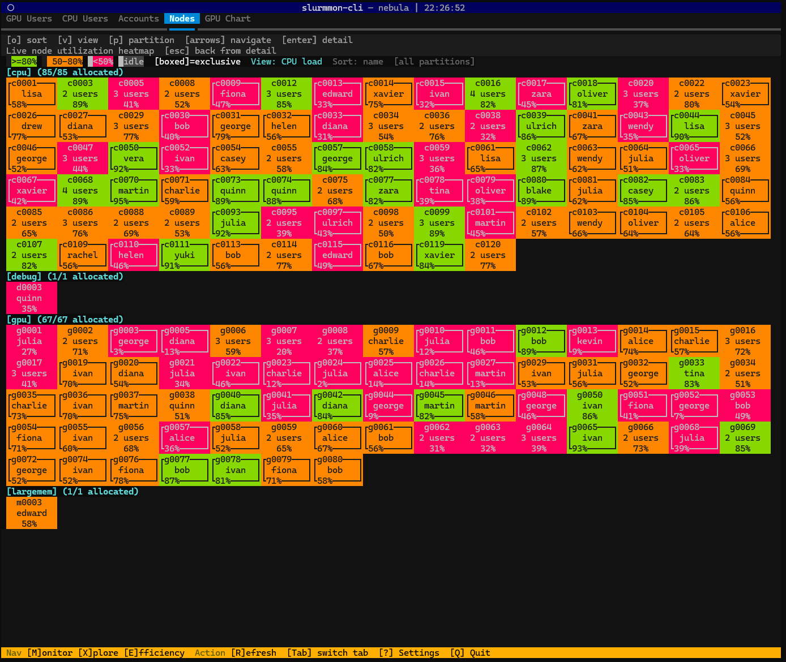
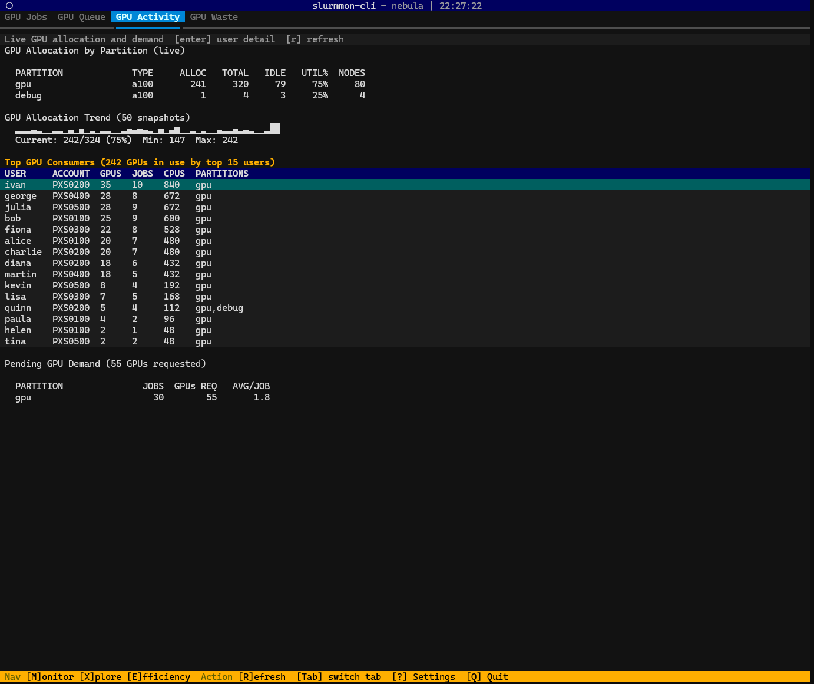

# slurmmon-cli

> Developed primarily for [Ohio Supercomputer Center (OSC)](https://www.osc.edu/) clusters such as Cardinal and Ascend. The core monitoring and analysis features work on any Slurm cluster; OSC-specific integrations (osc-seff, gpu-seff, Grafana) are gated behind a config flag.

<p align="center">
  
  
</p>

Lightweight CLI tool for monitoring Slurm cluster jobs. Designed to run on login nodes with minimal resource usage.

- Real-time TUI dashboard with multi-screen navigation (Textual-based)
- GPU-focused analysis: usage rankings, queue wait times, activity, waste detection
- Historical data collection to SQLite for trend analysis
- Per-user job breakdowns, fairshare tracking, node utilization heatmap
- OSC cluster support with GPU efficiency via `osc-seff` / `gpu-seff`
- Grafana URL generation for node metrics

## Installation

### Install

```bash
pip install -e .
```

Requires Python 3.10+. This installs the TUI dashboard ([Textual](https://github.com/Textualize/textual)) by default.

For a minimal install without the TUI (CLI commands only):

```bash
pip install --no-deps -e .
```

### Multi-cluster environments (e.g., OSC)

On sites where multiple clusters share a home directory but each has its own Python (via Spack, modules, etc.), `pip install` writes a console script with a hardcoded shebang pointing to the Python that ran the install. This means the `slurmmon-cli` command only works on the cluster where you installed it.

The portable alternative is `python -m slurmmon_cli`, which uses whichever `python` is in your current PATH:

```bash
# Works on any cluster regardless of where pip install was run
python -m slurmmon_cli

# Optional: add a shell alias to your ~/.bashrc
alias slurmmon-cli='python -m slurmmon_cli'
```

The SQLite database is shared across clusters automatically. Jobs from each cluster are tagged with their cluster name, so data from Cardinal and Ascend coexists in one DB.

### Uninstall

```bash
pip uninstall slurmmon-cli
```

This removes the package but leaves your data and config files (see below). To remove those as well:

```bash
rm -rf ~/.local/share/slurmmon-cli    # collected data
rm -rf ~/.config/slurmmon-cli         # configuration
```

### Data storage

slurmmon-cli follows the [XDG Base Directory Specification](https://specifications.freedesktop.org/basedir-spec/latest/):

| Path | Default | Contents |
|------|---------|----------|
| `$XDG_DATA_HOME/slurmmon-cli/data.db` | `~/.local/share/slurmmon-cli/data.db` | SQLite database (jobs, snapshots, sshare usage) |
| `$XDG_CONFIG_HOME/slurmmon-cli/config.ini` | `~/.config/slurmmon-cli/config.ini` | INI configuration file |

The database grows with cluster activity. Typical size is 1-10 MB for a few weeks of data on a medium-sized cluster (~3,000 jobs, ~1,000 sshare users per collection). Old records are automatically pruned based on `retention_days` (default: 30 days). You can also manually manage storage with `slurmmon-cli db prune` and `slurmmon-cli db vacuum`.

## Demo Mode

Try slurmmon-cli without a Slurm cluster using built-in synthetic data:

```bash
slurmmon-cli --demo            # launch TUI with a fictional "nebula" cluster
slurmmon-cli --demo explore --by gpu --top 10
```

The `--demo` flag generates a deterministic dataset (30 users, 212 nodes, ~2,800 jobs across 4 partitions) and patches all Slurm calls so no real cluster is needed. Data is stored in a temporary database that is cleaned up on exit. This is useful for trying out the tool, taking screenshots, or testing without exposing real cluster data.

## Quick Start

slurmmon-cli supports two modes of operation:

### Interactive TUI

Launch the dashboard with no arguments. It auto-collects cluster data on startup and provides four screens navigable by keyboard:

```bash
slurmmon-cli            # if installed on this cluster
python -m slurmmon_cli  # portable, works on any cluster
```

| Key | Screen | What it shows |
|-----|--------|---------------|
| `M` | Monitor | Real-time cluster overview: partitions, running/pending jobs |
| `X` | Explore | GPU/CPU usage rankings, accounts, node heatmap, GPU chart |
| `E` | Efficiency | GPU jobs, queue wait analysis, GPU activity, waste detection |
| `?` | Settings | View and modify configuration |

`Tab` switches tabs, `Enter` opens details, `Esc` closes, `Q` quits.

### CLI Commands

For scripting, cron jobs, or quick lookups without entering the TUI:

```bash
# Collect a data snapshot (good for cron)
slurmmon-cli collect

# Run collector as a daemon
slurmmon-cli collect --daemon --interval 300

# GPU usage rankings
slurmmon-cli explore --by gpu --top 20

# Queue wait time analysis
slurmmon-cli waits --by-hour --since 7d

# Per-user job summary
slurmmon-cli users --since 7d --sort cpus
```

| Command | Description |
|---------|-------------|
| `dashboard` / `d` | TUI dashboard (`-r` refresh, `--user`, `--partition`, `--from-db`) |
| `collect` | Snapshot cluster state (`--daemon`, `--interval`, `--retention`) |
| `explore` / `x` | GPU/resource explorer (`--by gpu\|cpu\|account\|requests\|delta\|nodes`) |
| `jobs` | List jobs (`--user`, `--state`, `--partition`, `--since`, `--sort`) |
| `users` | Per-user summary (`--since`, `--sort`, `--top`) |
| `waits` | Queue wait times (`--by-hour`, `--by-size`, `--partition`) |
| `efficiency` | Job efficiency (`--job`, `--user`, `--low`, `--gpu`) |
| `config` | Configuration (`config show`, `config set section.key value`) |
| `db` | Database management (`db info`, `db prune`, `db vacuum`) |

## Documentation

For detailed usage of each TUI screen, tab descriptions, key bindings, and configuration options, see the [User Guide](docs/user_guide.md).
